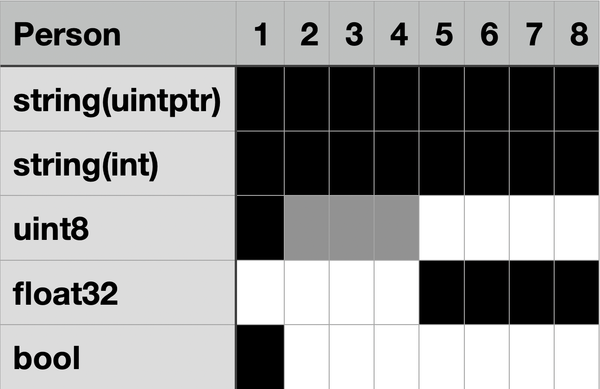
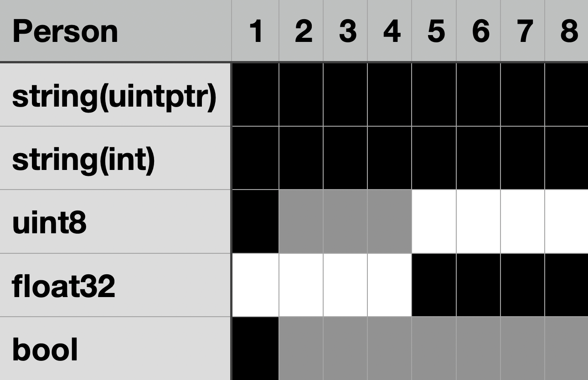

# Ultimate Go : Variable

## 내장 타입

내장 타입은 할당된 메모리의 크기와 어떤 값을 의미하는 지를 기반으로 이름이 정해집니다.  

|type|bit|zero value|
|---|---|---|
|uint8|8|0|
|uint16|16|0|
|uint32|32|0|
|uint64|64|0|
|int8|8|0|
|int16|16|0|
|int32|32|0|
|int64|64|0|
|float32|32|0.0|
|float64|64|0.0|
|complex32|32|0.0i|
|complex64|64|0.0i|
|int|32 or 64|0|
|uint|32 or 64|0|
|uintptr|32 or 64|0|
|byte|8|0|
|rune|32|0|
|string|16 + a|""|

int, uint, float, complex는 각각 정수, 부호없는 정수, 실수, 복소수를 의미하고 8, 16, 32, 64는 각 비트 수를 의미합니다.

단순 int, uint, uintptr은 32비트 아키텍처에선 32비트로 64비트의 그것에선 64비트로 할당됩니다.  
신기하게도 float은 이런 타입이 없고 그 덕에 complex도 이런게 없습니다.

byte와 rune은 각각 uint8과 int32의 별칭입니다.  
아시다시피 byte는 ASCII에 대응하기 위해 존재하며 rune은 unicode에 대응하기 위해 존재합니다.  

---

### 문자열

string 타입을 byte 배열로 나타내는 걸 string.go 파일을 통해 알 수 있습니다.

```go
type stringStruct struct {
	str unsafe.Pointer
	len int
}

// string의 포인터를 받고 stringStruct의 포인터로 형변환하는 걸 확인할 수 있습니다.
func stringStructOf(sp *string) *stringStruct {
	return (*stringStruct)(unsafe.Pointer(sp))
}

// rawstring 새로운 string을 위한 공간을 할당합니다.
// 같은 곳을 가리키는 string과 []byte를 반환합니다.
// 저장 공간의 크기는 0이 되지 않으며 문자열을 설정하기 위해 b를 사용합니다.
func rawstring(size int) (s string, b []byte) {
	p := mallocgc(uintptr(size), nil, false)

	stringStructOf(&s).str = p
	stringStructOf(&s).len = size

	*(*slice)(unsafe.Pointer(&b)) = slice{p, size, size}

	return
}
```

그렇기에 string을 인덱스로 접근하게 되면 byte를 반환하지만 range로 접근하게 되면 자연스럽게 rune으로 변환되어 반환됩니다.

```go
func main() {
	s := "hello, 세계!"
	for i, v := range s {
		fmt.Printf("\n%v\n", i)
		fmt.Printf("indexing: (%T) %v\n", s[i], s[i])
		fmt.Printf("range: (%T) %v %c\n", v, v, v)
	}
}
```

```bash
1
indexing: (uint8) 101
range: (int32) 101 e

2
indexing: (uint8) 108
range: (int32) 108 l

3
indexing: (uint8) 108
range: (int32) 108 l

4
indexing: (uint8) 111
range: (int32) 111 o

5
indexing: (uint8) 44
range: (int32) 44 ,

6
indexing: (uint8) 32
range: (int32) 32  

7
indexing: (uint8) 236
range: (int32) 49464 세

10
indexing: (uint8) 234
range: (int32) 44228 계

13
indexing: (uint8) 33
range: (int32) 33 !
```

인덱스를 통한 접근과 range를 통한 접근의 차이를 확인할 수 있는 코드입니다.  
인덱스로 접근을 하게 되면 그대로 byte로 읽어오기때문에 uint8로 타입이 나타나며 아스키코드를 출력하는 걸 확인할 수 있습니다.  
하지만 range로 접근하게 되면 rune으로 읽어오기에 아스키로 표현할 수 있어도 rune으로 읽어오고 유니코드 또한 원하는 대로 읽어오는 걸 확인할 수 있습니다.  

---

## 변환과 캐스팅

golang에는 캐스팅이라고 명시된 기능은 없지만 변환(conversion)과 단언(assertion)으로 대체할 수 있습니다.  
그 중 서로 다른 타입을 상호호환 가능하도록 타입을 바꿔주는 부분을 변환으로 처리할 수 있습니다.

```go
func main() {
    a := int64(55)
    // 99는 int 리터럴이므로 int64로 변환해야 연산이 가능합니다.
	fmt.Println(a + int64(99))
}
```

```bash
154
```

위 코드에서 변환을 사용하였습니다.

언뜻 보기에는 a에 int64 55, 연산 중에 int64 99만 존재했을 것같지만  
실제 흐름은 int 55가 int64로 변환되어 a에 저장되고 연산할 때도 int 99가 int64로 변환된 후 a와 더해졌다라고 봐야한다 생각합니다.

그래서 해당 부분 번역은 `컴파일러에게 몇 바이트를 더 쓰도록 지시하는 대신에 실제로 더 많은 메모리를 할당해야한다`가 되어야 한다고 생각합니다.

---

## 구조체

구조체는 다양한 타입의 컬렉션입니다.

```go
type Person struct {
    name string // 16
    age uint8 // 1
    height float32 // 4
    gender bool // 1
}
```

이름, 나이, 키, 성별을 저장하는 간단한 구조체입니다.  
이 구조체를 `unsafe.Sizeof(Person{})`로 크기를 측정하면 32가 나옵니다.

주석으로 적어놓았다시피 단순하게 계산하면 16 + 1 + 4 + 1 이 되어서 22가 되어야합니다.  
하지만 실제 용량은 32로 10 bit나 되는 용량이 더 들었다는 걸 확인할 수 있습니다.

이는 구조체 패딩(padding)때문인데 C 언어 때와 유사하게 적용할 수 있습니다.  
모든 타입의 메모리 상 시작 주소는 구조체 시작 주소 + 본인 크기의 배수가 되어야합니다. 또한 기본적으로 가질 수 있는 타입의 크기는 보통 8이 한계입니다. 

string이나 slice를 고려한다해도 실제로는 포인터(uintptr)와 길이 혹은 포인터(uintptr)와 길이(int), 용량(int)으로 8의 배수로 자리를 차지하고 이는 8 바이트 묶음으로 표현하기에 구조체 패딩 계산에선 가장 큰 8 byte를 가장 큰 단위로 잡습니다.

Person을 예로 들면 맨 앞에 string(16)이 오게됩니다.  
uint8은 1 바이트이므로 어디에나 놓을 수 있으니 바로 다음에 놓습니다.  
float32는 4바이트이므로 4의 배수 자리에 놓아야하니 age를 놓은 곳부터 가장 가까운 4의 배수 주소에 놓기 위해 3 바이트의 패딩을 놓고 그 뒤에 놓습니다.
bool은 1 바이트이므로 다시 바로 뒤에 붙힙니다.



그러면 총 16 + 1 + 3 + 4 + 1 로 25가 됩니다.  
잃어버린 7 바이트는 다음 규칙에서 찾을 수 있습니다.  

전체 구조체 크기는 가장 큰 타입 크기의 배수가 되어야합니다.  
Person 구조체의 가장 큰 타입은 string(16)이지만 위에 적어놓은 대로 8 바이트 묶음으로 처리하기에 최대 크기는 8이고 구조체 크기는 8의 배수가 되어야합니다.

그렇기에 25를 품을 수 있는 가장 큰 8의 배수인 32가 구조체의 크기가 되고 마지막 bool 뒤에 7 바이트의 패딩이 채워지게 됩니다.



마지막으로 얼티밋 고에서는 가장 큰 타입부터 놓는 것이 구조체 패딩 최적화에 도움이 될 거라고 했지만 구조체에 포함되는 타입을 파악하여 최대 크기에 맞게 잘 정렬하는 편이 단순히 큰 타입부터 넣는 것보다 도움이 될 거라 생각합니다.

```go
type SwitchA struct {
	a   bool
	b   bool
    c   bool
    tag string
    d   bool
	e   bool
	f   bool
}

type SwitchB struct {
	a   bool
	b   bool
	c   bool
	d   bool
	e   bool
	f   bool
	tag string
}
```

8개의 bool(1)과 1개의 string(16)을 가지는 해당 Switch는 SwitchA처럼 바보같이 선언하지만 않는다면 SwitchB처럼 가장 큰 string을 한쪽 구석에 잘 두면 전체 24 byte로 SwitchA의 전체 크기인 32 byte보다 훨씬 적은 메모리를 차지합니다.

반대로 구조체가 아무 타입도 가지지 않는 다면 크기는 어떨까요?

```go
type Void struct{}

func main() {
	a := Void{}
	println(unsafe.Sizeof(a))
}
```

```bash
0
```

해당 구조체, Void의 크기는 0 byte 입니다.  
실제로도 이 타입은 메모리에 0을 할당하는 것과 매우 유사한 효과를 볼 수 있습니다.  
이를 활용하여 간단하게 map을 set으로 사용할 수도 있습니다.

```go
type intSet map[int]struct{}
```

이러한 형태로 쓰면 bool 쓰는 것보다 메모리도 적게 쓰고 성능도 좋게 set을 구현할 수 있습니다.

---

## 이름 있는 타입과 익명 타입

이름 있는 타입은 위의 Person과 마찬가지로 특정한 이름을 가진 타입입니다.
이름 있는 타입 끼리는 암시적으로 대입할 수 없고 명시적인 변환 과정이 필요합니다.
하지만 익명 타입은 구조만 같다면 이름 있는 타입에 그대로 대입할 수 있습니다.

```go
type Person struct {
	name   string
	age    uint8
	gender bool
	height float32
}

type Korean struct {
	name   string
	age    uint8
	gender bool
	height float32
}

func main() {
	a := Person{"arin", 22, true, 174.5}
	k := Korean(a)
	fmt.Println(k)
}
```

```go
{arin 22 true 174.5}
```

위의 Person 구조체와 동일한 필드를 갖는 Korean 구조체를 선언하여 명시적으로 Person의 인스턴스를 Korean으로 변환하면 그대로 저장됨을 확인할 수 있습니다.

```go
func main() {
	bell := struct {
		name   string
		age    uint8
		gender bool
		height float32
	}{
		"bell", 29, false, 169.7,
	}
	k := Korean(a)
	fmt.Println(k)
}
```

또 익명 타입으로 선언된 bell은 Korean으로 암시적으로 바꾸어 줄 수 있
음을 확인할 수 있습니다. ~~이민~~

---

## 포인터

```go
a := 99
b := &a
*b += 1
fmt.Println(a)
```

위의 코드에서 a는 99를 저장하고 있으며 b는 a의 위치(address)를 저장하고 있습니다.  
주변에서 가장 많이 보는 유형으로는 윈도우의 바로가기나 unix-like의 symbolic link 에 빗댈 수 있겠습니다.  

변수의 위치는 & 연산자를 구할 수 있습니다.  
&a라면 a의 위치를 반환합니다.  
또 해당 위치에는 * 연산자를 통해 접근할 수 있습니다.
*&a라면 단편적으로는 99를 반환하게 됩니다.  

다시 코드로 돌아와서 b는 & 연산자를 통해 a의 위치를 받아서 저장했습니다.  
그리고 b에 * 연산자를 사용하여 a의 위치에 접근하여 1을 더했습니다.  
이 `*b += 1` 한 줄은 `a += 1`로 치환할 수 있습니다.  
결과적으로 a는 1이 증가하고 마지막 출력은 `100`이 됩니다.

C 언어와 그 형태가 닮아 있고 출력하면 주소 값을 보여주기때문에 C 언어의 포인터와 동일하게 생각될 수 있습니다.  
하지만 실제 사용 형태는 golang이 포인터 연산, 포인터 주소 값을 더하거나 빼는 혹은 곱하거나 나누는 등의 연산들을 일반적으로는 할 수 없게 막아놓았기에 C++의 참조(reference)에 가깝습니다.

```go
a := 99
*(&a + 1000) += 100
```

간단한 예로 이 코드를 실행하게 되면 1000을 포인터 값으로 바꿀 수 없다는 에러를 띄우며 컴파일 되지 않을 것입니다.

얼티밋 고에서는 스택과 힙을 포함해서 꽤 길게 써 주었지만 제가 생각하는 핵심은 다른 변수가 가지는 값의 symbolic link입니다.

---

### 값의 전달

포인터는 원래라면 여러 스택을 관통하는 변수를 사용하기 위해 매개변수로 넘겨주거나 힙에 저장된 인스턴스에 접근하는 용도로 쓰이게 됩니다.

```go
func inc(i *int) {
	(*i)++
}

func main() {
	a := 99
	inc(&a)
	fmt.Println(a)
}
```

해당 코드의 경우 main 스코프의 a를 inc 함수 스코프에서 접근하여 1을 더해줍니다.  
main에서는 1이 증가한 a를 출력하여 출력 값은 `100`이 됩니다.

조금 다른 사용처로 함수형 프로그래밍에서 자주 쓰이는 Optional을 흉내낼 수 있습니다.  
별 다른 노력을 들이지 않고도 값이 존재하지 않는 `nil`을 표현할 수 있기때문입니다.

```go
func find(str string, t rune) *int {
	for i, v := range str {
		if v == t {
			r := i
			return &r
		}
	}
	return nil
}

func main() {
	a := "hello, world!"
	println(*find(a, 'o'))
}
```

해당 코드는 특정 문자열에 어떤 문자가 가장 처음 나오는 인덱스를 반환합니다.  
일반적인 경우와 다르게 인덱스를 int 타입 포인터로 반환하고 없을 경우 nil을 반환합니다.  
하지만 보통은 이런 형식의 사용을 권장하지는 않습니다.  
바로 댕글링 포인터와 이스케이프 분석때문입니다.

---

## 이스케이프 분석(Escape Analysis)

```go
type Person struct {
	name   string
	age    uint8
	gender bool
	height float32
}

//go:noinline
func NewPerson(name string, age uint8, gender bool, height float32) Person {
	return Person{name, age, gender, height}
}

func main() {
	a := NewPerson("soulkey", 27, true, 165.3)
	println(a.name)
}
```

여기 단순한 생성자를 이용한 코드가 있습니다.  
해당 코드는 매개변수로 받은 데이터를 이용하여 새로운 Person의 인스턴스를 값으로 반환합니다.  
`go run -gcflags="-m"`을 이용하여 escape analysis 의 보고서를 받아 볼 수 있습니다.

```bash
☁  md  go run -gcflags="-m" main.go
# command-line-arguments
./main.go:15:6: can inline main
./main.go:11:16: leaking param: name to result ~r4 level=0
soulkey
```

만들어진 Person 인스턴스가 값 복사를 통해 반환하기때문에 아무런 행동도 이루어지지 않은 걸 확인할 수 있습니다.  
그럼 값(24 byte)을 복사하지 않고 포인터(8 byte)만 반환한다면 퍼포먼스가 더 올라가지 않을까요?  
그렇게 수정된 코드는 다음과 같습니다.

```go
type Person struct {
	name   string
	age    uint8
	gender bool
	height float32
}

//go:noinline
func NewPerson(name string, age uint8, gender bool, height float32) *Person {
	return &Person{name, age, gender, height}
}

func main() {
	a := NewPerson("soulkey", 27, true, 165.3)
	println(a.name)
}

```

해당 코드는 NewPerson이 바로 위 코드와 다르게 생성한 Person 인스턴스의 포인터를 반환합니다.  

```go
☁  md  go run -gcflags="-m" main.go
# command-line-arguments
./main.go:15:6: can inline main
./main.go:11:16: leaking param: name
./main.go:12:9: &Person literal escapes to heap
soulkey
```

이 코드는 Person 인스턴스가 heap으로 탈주했다고 보고해줍니다.  
왜냐하면 이 생성자는 댕글링 포인터를 만드는 생성자이기때문입니다.

댕글링 포인터는 가리키고 있는 변수가 존재하지 않게 되는 포인터를 의미합니다.
바로 위 코드가 가장 대표적인 예로 포인터를 반환하자마자 포인터가 가리키고 있어야 할 Person 인스턴스가 스택에 할당되어 있었다면 즉시 메모리에서 사라지게 됩니다.  
그리고 포인터를 * 연산자를 통해 접근하게 되면 의도하지 않은 곳에 접근하게 되어 상황에 따라 심각한 버그가 발생할 수도 있습니다.

이 현상을 golang 컴파일러는 미연에 방지하기 위해 댕글링 포인터가 발생하는 부분은 해당 변수를 처음부터 heap 에 할당하고 포인터는 heap의 위치를 가리키게 합니다.  
이러한 일련의 과정을 escape analysis 라고 합니다.

---

### 가비지 컬렉션

위 과정을 거쳐 heap 에 할당된 데이터들은 가비지 컬렉션(Garbage Collection, GC)의 영향 하에 놓이게 됩니다.  
특정 조건을 만족하여 GC가 작동하기 시작하면 모든 고루틴은 일시정지되고 heap 에서 사용이 끝난 데이터들을 지우기 시작합니다.

이 GC는 mgc.go에 따르면 크게 4가지 과정이 있습니다.  
* Sweep Termination
  + 런타임을 정지합니다.
  + 제거되지 않은 스윕 영역을 제거합니다. GC 사이클이 돌기 전에 강제로 GC가 발생할 경우 존재합니다. ( runtime.GC() )
* mark phase
  + write barrier와 mutator assists를 활성화하고 고루틴들의 맨 앞에 삽입합니다. 모든 프로세스에 write barrier가 활성화되기 전까지는 어떤 오브젝트도 스캔되지 않습니다.
  + 다시 런타임을 재생합니다. 이때, GC 작업도 시작됩니다. write barrier는 포인터를 만들거나 수정하는 걸 막아줍니다. 최근에 할당된 포인터들은 검정으로 마크됩니다.
  + 모든 전역 변수와 off-heap 포인터를 제외한 모든 스택의 포인터를 스캔합니다.
  + 회색 오브젝트를 찾아서 검정으로 바꾸며 연결된 모든 포인터를 숨깁니다.
  + 더 이상 찾을 게 없다면 다음으로 넘어갑니다.
* mark termination
  + 다시 런타임을 멈춥니다.
  + workers와 assists를 비활성화합니다.
  + mcache를 central cache로 미는 등 런타임을 정리합니다.
* sweep phase
  + write barrier를 비활성화합니다.
  + 최근에 추가된 친구들은 하양으로 바꿉니다. 필요하면 스윕 영역을 만듭니다.
  + 백그라운드에서 동시적으로 오브젝트를 정리하며 할당에 대해 응답합니다.
* 다시 충분한 양의 공간을 할당했다면 과정을 반복합니다.

보통 여기서 충분한 양의 공간 할당은 직전 GC 수행 시 남은 heap 용량의 2배가 됩니다.  
이 수치는 컴파일 시에 `GOGC=100 go build`와 같은 형태로 설정할 수 있습니다.  
GOGC의 값은 현재 heap 용량의 몇 퍼센트가 추가되었는 지를 명시합니다.  
GOGC가 100이라는 것은 현재 heap 의 100%가 추가 되었을 때 GC를 수행하므로 2배를 의미합니다.  
보통은 이 값이 기본값입니다.

`GOGC=0 go build`처럼 GOGC를 0으로 설정하면 golang의 런타임은 자동으로 GC를 수행하지 않습니다.  
대신 `runtime.GC()` 함수를 사용하여 명시적으로 GC를 수행할 수 있습니다.  
이는 때때로 간단한 유틸리티나 영속적(persistant)인 데이터가 메모리에 꾸준히 작성될 때 필요없는 GC를 수행할 필요가 없어서 더 유리할 수 있습니다.

이와는 별개로 GC의 최적화 덕분에 인터페이스와 타입 단언이나 `reflect`패키지의 성능이 비약적으로 상승하여 마치 weak type 언어처럼 작성하더라도 좋은 성능을 보여주게 되었습니다.

---

## 함수

golang의 함수는 기본적으로 다음과같은 형태를 가집니다.

```go
func addOne(x int) int {
	return x + 1
}
```

addOne 함수는 int 타입 x를 받아서 1을 더한 후 반환합니다.  
func 예약어로 시작하고 함수 이름과 매개변수, 반환타입을 갖는 일반적인 형태입니다.

golang의 함수는 golang답지 않게 몇 가지 단맛이 느껴지는 부분이 있습니다.  
그 중 첫번째는 다른 언어에서도 쉽게 찾아볼 수 있는 가변 매개변수입니다.

```go
func addAll(i ...int) int {
	r := 0
	for _, v := range i {
		r += v
	}
	return r
}
```

addAll 함수는 매개변수로 들어온 int 타입 변수들을 모두 더해서 반환합니다.  
이때 `...int`로 표현한 i 변수는 슬라이스로 코드에 적용되고 `for range` 문법을 통해 손 쉽게 순회할 수 있습니다.  

두번째는 반환값입니다.

```go
func addAll(i ...int) (r int) {
	for _, v := range i {
		r += v
	}
	return r
}

func getMaxMin(i ...int) (int, int) {
	min := math.MaxInt64
	max := math.MinInt64
	for _, v := range i {
		if min > v {
			min = v
		}
		if max < v {
			max = v
		}
	}
	return max, min
}
```

addAll 함수는 방금 전과 달리 함수 선언부에 반환값인 r을 선언한 모양입니다.  
getMaxMin 함수는 2개의 반환 타입을 선언부에 작성하여 한번에 여러개의 반환값을 가질 수 있음을 보여줍니다.  
이러한 형태는 golang 표준 패키지들에서 쉽게 찾아볼 수 있으며 후자의 경우는 `error`를 반환하는 데 주로 쓰입니다.

세번째로는 클로저(closure)입니다.  
golang도 일급 함수를 지원하기에 당연하게 클로저를 지원합니다.

```go
func getFibGen() func() uint64 {
	f, s := uint64(0), uint64(0)
	return func() uint64 {
		f, s = s, f+s
		return uint64(f)
	}
}

func main() {
	a := getFibGen()
	for i := 0; i < 10; i++ {
		fmt.Println(a())
	}
}
```

```bash
☁  md  go run main.go
1
1
2
3
5
8
13
21
34
55
```

getFinGen 함수는 내부에 f와 s 변수를 가지고 익명 함수를 반환합니다.  
반환된 함수는 실행될 때마다 상위 스택에서 f와 s를 읽어서 다음 피보나치 수열 값을 출력합니다.

마지막으로 `defer`가 있습니다만 `derfer`는 후에 비동기나 예외 처리같은 부분에서 나올 거라 작성하지 않겠습니다.

---

## 상수

상수는 컴파일 타임에 해당 위치에 대치되는 일종의 표현식입니다.  
상수는 간단하게 `const` 예약어를 통해 선언할 수 있습니다.

```go
const a = 100

func main() {
	var i18 int8 = a
	var i16 int16 = a
	var i32 int32 = a
	var i64 int64 = a
}
```

해당 상수, a는 100으로 초기화되었지만 실제 가지는 타입은 untyped int입니다.  
이는 int 타입이라고 고려는 하는데 실제로 타입으로는 정해져있지는 않다는 것을 의미합니다.  
실제로 아래 `main` 함수에서 크기가 다른 각 int 타입에 대입해도 에러가 나지 않습니다.  
만약 int 타입으로 고정이 되었다면 타입 변환을 통해 각 변수에 대입해야 할 것입니다.

```go
const a int = 100

func main() {
	var i18 int8 = int8(a)
	var i16 int16 = int16(a)
	var i32 int32 = int32(a)
	var i64 int64 = int64(a)
}
```

하지만 이 코드처럼 상수에 타입을 지정해주게 된다면 `main` 함수에서 작성한 대로 타입 변환을 해주지 않으면 에러가 날 것입니다.

만약 서로 다른 타입으로 예측될 수 있는 상수를 선언한다면 유형 승급(kind promotion)에 의해 더 높은 유형으로 통일될 것입니다.

```go
const f = 3 * 3.141592
```

```go
const f untyped float = 9.42478
```

상수 f의 경우 int 형 상수와 float 형 상수의 곱으로 이루어져 있기에 자연스럽게 int가 float으로 승급되어 f는 float 형 상수가 됩니다.  
이것은 다른 golang 원시 타입의 연산에서도 동일하게 적용되는 법칙입니다.

서로다른 타입의 상수를 연산하게 될 경우에도 일반적인 연산과 동일하게 서로 타입을 맞춰줘야 합니다.  
하지만 타입이 정해져 있지 않은 상수일 경우 자동으로 해당 타입으로 맞춰집니다.

```go
const i32 int32 = 100
const i64 int64 = 200
const result = int64(i32) + i64
```

```go
const ut = 100
const i64 int64 = 200
const result = ut + i64
```

마지막으로 타입이 정해지지 않은 상수는 256 bit의 크기를 가지므로 일반적인 타입보다 훨씬 큰 값으로 선언할 수 있습니다.

```go
const i = 115792089237316195423570985008687907853269984665640564039457584007913129639936
```

i는 2^256으로 선언하였지만 에러가 나지 않는 것을 확인할 수 있습니다.

---

### iota

iota는 같은 const 블록 안에서 선언된 부분부터 1씩 증가하며 대입하는 일종의 설탕입니다.  
반복문처럼 아래로 내려갈 수록 1씩 증가하는 특성때문에 여러 방법으로 쓰이고 있습니다.

```go
const (
	First = iota
	Second
	Third
)
```

이 경우에는 단순히 타입이 정해지지 않은 int 타입 상수로 각각 0, 1, 2로 선언됩니다.

```go
const (
	Greater = uint8(iota)
	Less
	Equal
)
```

이 경우에는 uint8 타입 상수로 각각 0, 1, 2로 선언됩니다.

```go
const (
	s1 = 1 << iota
	s2
	s3
	s4
	s5
	s6
	s7
	s8
)
```

이 경우에는 각각 1의 left shift가 0~7까지 수행되어 1, 2, 4, 8, 16, 32, 64, 128로 선언됩니다.

---

### 번역

상수 부분 제일 앞 문장에 보면 영어 원문과 재방문 표시가 되어 있습니다.

Constants are not variables. Constants have a parallel type system all to themselves. The minimum precision for constant is 256 bit. They are considered to be mathematically exact. Constants only exist at compile time.

단순 직역해서  
상수는 변수가 아니다. 모든 상수는 평행 타입 시스템을 가지고 있으며 정밀도는 256 비트이다. 256 비트는 수학적으로 정확하며 상수는 컴파일 타임에만 존재한다.  
로 할 수 있겠지만 평행 타입 시스템이 어떤 건지 느낌은 있습니다만 말로 표현하기가 어렵습니다.

괜찮은 표현이 있다면 추천해주셨으면 합니다.